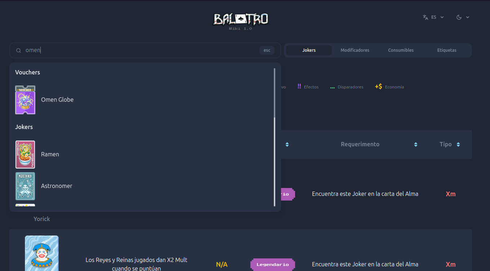

# Balatro Wiki 1.0



### Overview

Wiki app for Balatro.

View Live [localhost](http://localhost/)

### Tech stack

- **Typescript**
- **React**
- **TailwindCSS**
- **Node.js**
- **ElasticSearch**

### Setup

Make sure you have installed the latest version of docker desktop on your machine and on your path.

###### Development

Create .env files accordingly for each .env-template

Using Docker Containers

```sh
make watch
```

Go visit [localhost](http://localhost/)
